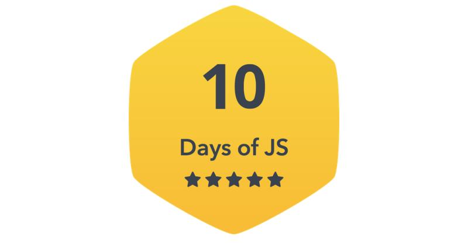

## Complete solution to all problems in Hackerrank's 10 days of  challenge
 

### Feel free to use and share😀
### Give this repo a star if it helped you out🎇

 

 
 

  
Found something useful here?😍 motivate me by a coffee😊☕

  

   